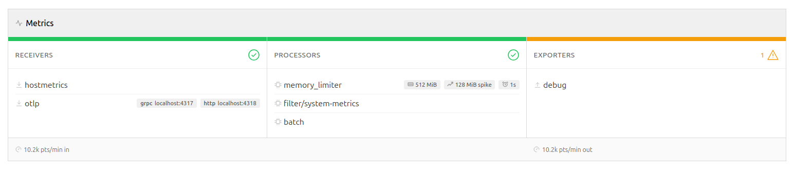

<div align="center">
    
    <h1>Signal Studio</h1>
    <p>
        A diagnostic tool for OpenTelemetry Collector. Paste your Collector YAML, connect to a live Prometheus endpoint, or tap OTLP traffic. Get actionable recommendations to reduce telemetry noise and improve pipeline health.
    </p>
    <br/><br/>
</div>


## Quick Start

```sh
docker build -t signal-studio .
docker run -p 8080:8080 signal-studio
```

Open http://localhost:8080.

## Features

### Config Analysis


Paste or upload your Collector YAML to get pipeline visualization, linting findings, and copy-paste remediation snippets. Covers missing processors, ordering issues, security concerns, and misconfigurations across a suite of static rules.

### Live Metrics



Connect to a running Collector's Prometheus endpoint to see per-pipeline throughput, per-component rates, queue utilization, and live anomaly detection (high drop rates, queue saturation, receiver-exporter mismatches).

### OTLP Sampling Tap


Discover metric names and attributes flowing through your Collector by adding a fan-out exporter. The UI shows the exact YAML snippet to add. The tap builds a live catalog of metric metadata — names, types, attribute keys, sample values, and cardinality — and predicts which metrics your `filter` processors would keep or drop (legacy + OTTL syntax, including attribute-based expressions).

Enabled by default; disable with `SIGNAL_STUDIO_TAP_DISABLED=true`.

### Alert Coverage

Paste Prometheus alerting rules to detect alerts that reference metrics your Collector would drop or fail to deliver. Supports both raw rule files and Kubernetes `PrometheusRule` CRDs.

<!-- BEGIN GENERATED:config -->

## Configuration

| Variable                                | Default | Description                            |
| --------------------------------------- | ------- | -------------------------------------- |
| `SIGNAL_STUDIO_PORT`                    | `8080`  | HTTP server port                       |
| `SIGNAL_STUDIO_SCRAPE_INTERVAL_SECONDS` | `10`    | Metrics polling interval (5–30)        |
| `SIGNAL_STUDIO_MAX_YAML_SIZE_KB`        | `256`   | Maximum YAML body size                 |
| `SIGNAL_STUDIO_CORS_ORIGINS`            | `*`     | Allowed CORS origins (comma-separated) |
| `SIGNAL_STUDIO_TAP_DISABLED`            | `false` | Disable the OTLP sampling tap          |
| `SIGNAL_STUDIO_TAP_GRPC_ADDR`           | `:5317` | gRPC listen address for the OTLP tap   |
| `SIGNAL_STUDIO_TAP_HTTP_ADDR`           | `:5318` | HTTP listen address for the OTLP tap   |

<!-- END GENERATED:config -->

## Development

**Backend** (Go 1.24+):

```sh
cd backend
go run ./cmd/server
```

**Frontend** (Node 22+):

```sh
cd frontend
npm install
npm run dev
```

Vite starts on `:5173` and proxies `/api` requests to the backend.

## Documentation

- [Rules reference](docs/rules.md) — full list of static, live, and catalog rules
- [API reference](docs/api.md) — HTTP endpoints
- [Architecture decisions](docs/adr/) — ADRs documenting design choices
- [Generating docs](docs/generating-docs.md) — how to regenerate documentation from code
